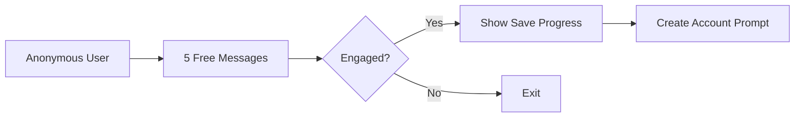

# Omni App - Freemium Monetization Strategy & Implementation Guide

## Executive Summary

### Pricing Strategy
- **Free Tier**: Limited AI chat (5 messages/day), basic features
- **Premium**: $9.99/month or $79.99/year (33% annual discount)
- **Target Conversion Rate**: 5-8% overall (anonymous → premium)
- **Competitor Benchmarks**: Calm ($14.99), Headspace ($12.99), Wysa ($99.99)

### Key Success Metrics
- Anonymous → Account: 30-40%
- Account → Trial: 15-20%
- Trial → Paid: 40-50%
- Monthly Churn: <5%

---

## Current Implementation Status

### ✅ Already Implemented
- [x] Basic AI chat functionality with OpenAI
- [x] Daily message limits (currently 10/day)
- [x] Anonymous user support with Firebase Auth
- [x] Free-form journaling
- [x] Basic mood tracking
- [x] Chat history viewing
- [x] Voice chat UI (locked behind paywall)
- [x] Tagged journal entries (locked behind paywall)
- [x] Themed journal prompts (locked behind paywall)
- [x] PaywallView component
- [x] Daily message counter display
- [x] Server-side message tracking

### 🚧 Partially Implemented
- [x] Anxiety management (UI exists, content needed)
- [x] User authentication flow (needs trial integration)
- [ ] Premium user detection (isPremium field exists, subscription logic missing)

### ❌ Not Yet Implemented
- [ ] RevenueCat/StoreKit integration
- [ ] 7-day free trial system
- [ ] Subscription management
- [ ] Receipt validation
- [ ] Advanced mood analytics
- [ ] Data export (PDF/CSV)
- [ ] Priority response system
- [ ] Custom companion personality
- [ ] Streak tracking
- [ ] Referral system
- [ ] Email automation
- [ ] Usage analytics dashboard
- [ ] Push notifications for engagement
- [ ] Win-back campaigns

---

## Free Tier Specifications

### Features Included
| Feature | Current Limit | Recommended Limit | Status |
|---------|--------------|-------------------|---------|
| AI Chat Messages | 10/day | 5/day | 🚧 Needs adjustment |
| Mood Tracking | Unlimited | 1/day | ❌ Not limited |
| Free-form Journal | Unlimited | Unlimited | ✅ Implemented |
| Chat History | All | 7 days | ❌ Not limited |
| Anxiety Exercises | None | 1/week | ❌ Not implemented |
| Daily Affirmation | None | 1/day | ❌ Not implemented |

### Anonymous User Limits
```swift
// Current Implementation
struct AnonymousUserLimits {
    static let dailyMessages = 10  // TODO: Reduce to 5
    static let historyDays = nil   // TODO: Limit to 3 days
    static let sessionTimeout = nil // TODO: Add 72 hour timeout
}
```

---

## Premium Features Implementation Status

### Core Premium Features

#### ✅ Unlimited AI Chat Messages
**Status**: Logic exists, needs subscription check
**Implementation**: Already tracks daily limits, just needs to bypass for premium users

#### ✅ Voice Chat with AI
**Status**: UI implemented, locked behind paywall
**Current Location**: `ChatView.swift` - InputModeSelector
```swift
// Already implemented in InputModeSelector
if authManager.currentUser?.isPremium == true {
    selectedMode = .voice
} else {
    showVoicePaywall = true
}
```

#### ❌ Advanced Mood Analytics
**Status**: Not implemented
**Requirements**:
- Create MoodAnalyticsView with charts
- Implement trend analysis in MoodManager
- Add insights generation
**Implementation TODO**:
```swift
struct MoodAnalyticsView: View {
    // TODO: Implement
    // - Weekly/monthly mood charts
    // - Mood patterns identification
    // - Correlation with journal entries
    // - Exportable reports
}
```

#### ✅ Tagged & Themed Journaling
**Status**: UI exists, properly gated
**Location**: `JournalView.swift`

#### ❌ Extended Chat History (90+ days)
**Status**: Not implemented
**Requirements**:
- Modify ChatService to limit history based on user tier
- Add date filtering to Firestore queries
**Implementation TODO**:
```swift
func loadChatHistory(isPremium: Bool) async {
    let daysLimit = isPremium ? 90 : 7
    let cutoffDate = Calendar.current.date(
        byAdding: .day, 
        value: -daysLimit, 
        to: Date()
    )!
    // Query Firestore with date filter
}
```

#### ❌ Personalized AI Insights
**Status**: Not implemented
**Requirements**:
- Weekly insight generation Cloud Function
- InsightsView component
- Push notification system
**Implementation TODO**:
```typescript
// Cloud Function for weekly insights
exports.generateWeeklyInsights = functions.pubsub
    .schedule('every monday 09:00')
    .onRun(async (context) => {
        // Analyze user's week
        // Generate personalized insights
        // Send push notification
    });
```

#### ❌ Data Export (PDF/CSV)
**Status**: Not implemented
**Requirements**:
- Export service with PDF generation
- CSV formatter for data
- Share sheet integration
**Implementation TODO**:
```swift
class ExportService {
    func exportChatHistory(format: ExportFormat) async throws -> URL {
        // TODO: Implement PDF/CSV generation
    }
    
    func exportMoodData(format: ExportFormat) async throws -> URL {
        // TODO: Implement mood data export
    }
}
```

#### ❌ Priority Response Time
**Status**: Not implemented
**Requirements**:
- Queue system in Firebase Functions
- Priority flag in message documents
**Implementation TODO**:
```typescript
// In aiChat cloud function
const isPremium = userData.isPremium || false;
const priority = isPremium ? 'high' : 'normal';

// Process high priority messages first
if (priority === 'high') {
    // Immediate processing
} else {
    // Add to queue with delay
}
```

#### ❌ Custom Companion Personality
**Status**: Not implemented
**Requirements**:
- Personality settings in User model
- System prompt customization
- UI for personality selection
**Implementation TODO**:
```swift
struct CompanionPersonality: Codable {
    enum Style: String, CaseIterable {
        case supportive = "Warm and supportive"
        case analytical = "Logical and analytical"
        case motivational = "Energetic and motivating"
        case gentle = "Soft and gentle"
    }
    
    var style: Style = .supportive
    var name: String = "Omni"
    var customTraits: [String] = []
}
```

---

## Anonymous User Journey Implementation

### Phase 1: First Contact (0-3 days)


**Implementation Required**:
```swift
// In AuthenticationManager
func trackAnonymousUsage() {
    let key = "anonymousMessageCount"
    let count = UserDefaults.standard.integer(forKey: key)
    
    if count >= 3 {
        showSaveProgressPrompt()
    }
    
    if count >= 10 {
        showAccountRequiredPrompt()
    }
}
```

### Phase 2: Account Creation Incentive
```swift
struct AccountCreationIncentive: View {
    var body: some View {
        VStack {
            Text("Create Your Free Account")
            Text("✓ Save your chat history")
            Text("✓ Track your mood over time")
            Text("✓ Get 7-day premium trial")
            
            Button("Sign Up & Try Premium") {
                // Trigger signup with trial
            }
        }
    }
}
```

### Phase 3: Trial Conversion Flow
**Email Sequence** (Not Implemented):
- Day 1: Welcome & feature guide
- Day 3: Usage milestone celebration
- Day 5: Success story
- Day 6: Discount offer (20% off)
- Day 7: Last chance reminder

---

## Implementation Roadmap

### Phase 1: Core Infrastructure (Week 1-2)

#### Priority 1: RevenueCat Integration
```swift
// 1. Add RevenueCat SDK
// In AppDelegate or App.swift
import RevenueCat

Purchases.configure(withAPIKey: "your_api_key")

// 2. Create SubscriptionManager
class SubscriptionManager: ObservableObject {
    @Published var isPremium = false
    @Published var isInTrial = false
    
    func checkSubscriptionStatus() async {
        // TODO: Implement RevenueCat status check
    }
    
    func startTrial() async throws {
        // TODO: Implement trial start
    }
    
    func subscribe() async throws {
        // TODO: Implement subscription
    }
}
```

#### Priority 2: Reduce Message Limits
```swift
// In User.swift
var maxDailyMessages: Int {
    if isPremium { return Int.max }
    if isInTrial { return Int.max }
    return 5 // Reduced from 10
}
```

#### Priority 3: Trial System
```swift
struct TrialStatus: Codable {
    let startDate: Date
    let endDate: Date
    let isActive: Bool
    
    var daysRemaining: Int {
        Calendar.current.dateComponents([.day], 
            from: Date(), 
            to: endDate
        ).day ?? 0
    }
}
```

### Phase 2: Premium Features (Week 3-4)

#### Advanced Mood Analytics
```swift
struct MoodAnalyticsView: View {
    @StateObject var analyticsManager = MoodAnalyticsManager()
    
    var body: some View {
        ScrollView {
            // Weekly mood chart
            MoodChartView(data: analyticsManager.weeklyData)
            
            // Insights
            MoodInsightsCard(insights: analyticsManager.insights)
            
            // Patterns
            MoodPatternsView(patterns: analyticsManager.patterns)
        }
    }
}
```

#### Data Export Service
```swift
import PDFKit

class DataExportService {
    func exportToPDF(sessions: [ChatSession]) -> URL? {
        let pdfDocument = PDFDocument()
        // TODO: Generate PDF pages
        return nil
    }
    
    func exportToCSV(data: [MoodEntry]) -> URL? {
        // TODO: Generate CSV
        return nil
    }
}
```

### Phase 3: Conversion Optimization (Week 5-6)

#### Paywall A/B Testing
```swift
enum PaywallVariant: String {
    case control = "control"        // Current paywall
    case social = "social_proof"     // With testimonials
    case urgency = "time_limited"    // With countdown
    case value = "value_focused"     // Feature comparison
}

class PaywallExperiment {
    func getVariant() -> PaywallVariant {
        // TODO: Implement A/B test assignment
        return .control
    }
    
    func trackConversion(variant: PaywallVariant) {
        // TODO: Track to analytics
    }
}
```

---

## Revenue Infrastructure Setup

### 1. App Store Configuration
- [ ] Create subscription products in App Store Connect
  - Monthly: com.jns.Omni.premium.monthly ($9.99)
  - Annual: com.jns.Omni.premium.annual ($79.99)
  - Set up 7-day free trial for both

### 2. RevenueCat Setup
```bash
# Installation
pod 'RevenueCat'
# or
.package(url: "https://github.com/RevenueCat/purchases-ios.git", from: "4.0.0")
```

### 3. Firebase Functions for Receipt Validation
```typescript
exports.validateReceipt = functions.https.onCall(async (data, context) => {
    const { receipt } = data;
    const userId = context.auth?.uid;
    
    // Validate with Apple
    // Update user's premium status in Firestore
    // Return validation result
});
```

### 4. Subscription Webhook Handler
```typescript
exports.handleSubscriptionUpdate = functions.https.onRequest(async (req, res) => {
    // RevenueCat webhook
    const event = req.body;
    
    switch(event.type) {
        case 'INITIAL_PURCHASE':
        case 'RENEWAL':
            // Grant premium access
            break;
        case 'CANCELLATION':
        case 'EXPIRATION':
            // Revoke premium access
            break;
    }
});
```

---

## A/B Testing Strategy

### Test 1: Message Limits
- Variant A: 3 messages/day
- Variant B: 5 messages/day (current plan)
- Variant C: 7 messages/day
- **Metric**: Conversion to account creation

### Test 2: Trial Length
- Variant A: 3-day trial
- Variant B: 7-day trial (recommended)
- Variant C: 14-day trial
- **Metric**: Trial to paid conversion rate

### Test 3: Credit Card Requirement
- Variant A: Credit card required for trial
- Variant B: No credit card for trial
- **Metric**: Trial start rate vs. conversion rate

### Test 4: Pricing
- Variant A: $7.99/month
- Variant B: $9.99/month (recommended)
- Variant C: $12.99/month
- **Metric**: Total revenue per user

---

## Analytics Implementation

### Key Events to Track
```swift
// Analytics events
enum AnalyticsEvent: String {
    // Onboarding
    case anonymousUserStarted = "anonymous_user_started"
    case accountCreated = "account_created"
    case trialStarted = "trial_started"
    
    // Usage
    case dailyLimitReached = "daily_limit_reached"
    case paywallViewed = "paywall_viewed"
    case paywallDismissed = "paywall_dismissed"
    
    // Conversion
    case subscriptionStarted = "subscription_started"
    case subscriptionCancelled = "subscription_cancelled"
    case subscriptionRenewed = "subscription_renewed"
}
```

### User Properties to Track
```swift
struct UserAnalyticsProperties {
    let messagesSent: Int
    let daysActive: Int
    let journalEntries: Int
    let moodTracked: Int
    let isPremium: Bool
    let isInTrial: Bool
    let daysSinceInstall: Int
}
```

---

## Email Automation Sequences

### Trial Sequence (7-day)
```typescript
const trialEmails = [
    {
        day: 0,
        subject: "Welcome to Omni Premium! 🎉",
        template: "trial_welcome"
    },
    {
        day: 3,
        subject: "You've sent 50 messages already!",
        template: "trial_milestone"
    },
    {
        day: 5,
        subject: "Sarah's story: How Omni changed her life",
        template: "trial_testimonial"
    },
    {
        day: 6,
        subject: "Your trial ends tomorrow - Save 20%",
        template: "trial_ending_discount"
    },
    {
        day: 7,
        subject: "Last chance: Lock in your discount",
        template: "trial_final_reminder"
    }
];
```

---

## Future Enhancements

### Premium Plus Tier ($19.99/month)
- [ ] Live therapist matching
- [ ] Group therapy sessions
- [ ] Family accounts
- [ ] Priority human support

### Enterprise/B2B ($49/user/month)
- [ ] Admin dashboard
- [ ] Usage analytics
- [ ] HIPAA compliance
- [ ] SSO integration
- [ ] Custom branding

### Additional Monetization
- [ ] Themed content packs ($2.99 each)
- [ ] Workshop recordings ($19.99)
- [ ] Meditation library ($4.99/month add-on)
- [ ] API access for researchers ($299/month)

---

## Implementation Checklist for Claude Code

### Immediate Actions (Priority 1)
- [ ] Reduce daily message limit from 10 to 5 in `User.swift`
- [ ] Install RevenueCat SDK
- [ ] Create SubscriptionManager class
- [ ] Add subscription products to App Store Connect
- [ ] Implement trial start flow
- [ ] Update PaywallView with trial offer

### Week 1 Tasks
- [ ] Implement subscription status checking
- [ ] Add receipt validation Cloud Function
- [ ] Create trial countdown UI
- [ ] Implement account creation incentives
- [ ] Add usage tracking analytics

### Week 2 Tasks
- [ ] Build mood analytics view
- [ ] Implement data export service
- [ ] Create streak tracking system
- [ ] Add priority response logic
- [ ] Implement email triggers

### Week 3 Tasks
- [ ] Build referral system
- [ ] Create A/B testing framework
- [ ] Implement push notifications
- [ ] Add custom personality settings
- [ ] Create admin dashboard

---

## Success Criteria

### Month 1 Goals
- 1000 anonymous users
- 300 account creations (30%)
- 45 trial starts (15%)
- 18 paid subscriptions (40% of trials)

### Month 3 Goals
- 5000 anonymous users
- 1750 account creations (35%)
- 350 trial starts (20%)
- 175 paid subscriptions (50% of trials)
- <5% monthly churn

### Month 6 Goals
- 20,000 anonymous users
- 8000 account creations (40%)
- 2000 paid subscriptions
- $20,000 MRR
- <3% monthly churn

---

## Notes for Implementation

1. **Start with RevenueCat** - It handles most subscription complexity
2. **Test pricing carefully** - Use staged rollouts
3. **Monitor funnel closely** - Set up analytics before launch
4. **Iterate based on data** - Don't guess, measure
5. **Focus on value** - Users pay for outcomes, not features

This document should be updated as features are implemented. Mark items as ✅ when complete.